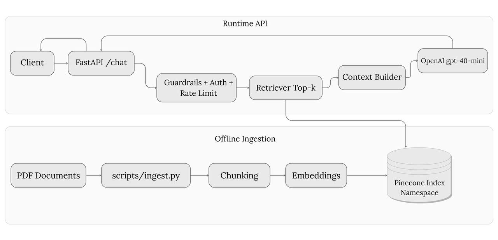

# Production RAG API

## Overview

Production-grade Retrieval-Augmented Generation backend built on FastAPI, Pinecone, and OpenAI. The system accepts natural-language queries, retrieves relevant document chunks from a namespaced Pinecone vector index, and generates answers constrained strictly to the retrieved context. Ingestion runs as a separate offline pipeline with SHA-256 manifest tracking to eliminate redundant embedding operations. Cost is controlled through bounded retrieval (TOP_K), optional TTL-based response caching, and deterministic ingestion. Multi-project isolation is achieved via Pinecone namespaces. The API enforces content guardrails, per-key rate limiting, and optional authentication.

## Architecture

<p align="center">
  
</p>


- Ingestion is fully decoupled from the API runtime.
- SHA-256 manifests prevent redundant embedding.
- Responses include structured sources and metadata.

## Capabilities

- Context-grounded answers with strict "I don't know" fallback
- Source attribution per response (file, page)
- Per-API-key rate limiting (falls back to per-IP)
- Optional API key authentication
- Content guardrails via configurable blocklist
- TTL-based in-memory response caching
- Structured JSON logging with request-ID correlation
- Health endpoint for load balancer probes
- Offline test coverage (no credentials required)
- Deterministic cleanup tooling for vector maintenance
- Accuracy evaluation workflow (RAGAS + offline overlap metrics)

## Quickstart

```bash
python -m venv venv && venv\Scripts\activate
pip install -r requirements.txt
copy .env.production.template .env        # configure API keys
python scripts/ingest.py                  # see note below
uvicorn app.main:app --host 0.0.0.0 --port 8000 --reload
```

Verify:

```bash
curl http://localhost:8000/health

curl -X POST http://localhost:8000/chat \
  -H "Content-Type: application/json" \
  -H "X-API-Key: your-key" \
  -d '{"question": "What is the refund policy?", "history": []}'
```

## Configuration

| Variable | Purpose | Production Note |
|---|---|---|
| `OPENAI_API_KEY` | OpenAI API key | Required |
| `PINECONE_API_KEY` | Pinecone API key | Required |
| `PINECONE_INDEX_NAME` | Target Pinecone index | Required |
| `NAMESPACE` | Pinecone namespace | Use to isolate environments |
| `OPENAI_MODEL` | Chat model (`gpt-4o-mini`) | -- |
| `EMBEDDING_MODEL` | Embedding model (`text-embedding-3-small`) | Index dimension must be 1536 |
| `TOP_K` | Chunks retrieved per query (`4`) | Increase with caution (cost) |
| `BLOCKLIST` | Comma-separated blocked terms | `politics,violence` |
| `REQUIRE_API_KEY` | Enforce `X-API-Key` header (`false`) | Set `true` in production |
| `API_KEY` | Expected key value (`change_me`) | Use a strong random value |
| `RATE_LIMIT` | Rate limit per key/IP (`5/minute`) | `60/minute` recommended |
| `CACHE_TTL_SECONDS` | Response cache TTL (`0` = off) | `60` recommended |
| `CACHE_MAX_ITEMS` | Cache capacity (`128`) | -- |
| `EVAL_MODE` | Expose raw chunks in meta (`false`) | Evaluation only |
| `DATA_DIR` | PDF source directory (`./data`) | -- |

## API

**GET /health** returns `{"status": "ok"}`.

**POST /chat** accepts:

```json
{"question": "...", "history": [{"role": "user", "content": "..."}, {"role": "assistant", "content": "..."}]}
```

Returns:

```json
{
  "answer": "...",
  "sources": [{"source": "file.pdf", "page": 3}],
  "meta": {"model": "gpt-4o-mini", "chunks_used": 4, "latency_ms": 1200.0, "cache_hit": false}
}
```

The model answers exclusively from retrieved context. When context is insufficient, it returns a refusal. When `EVAL_MODE=true`, `meta.contexts` includes raw chunk texts.

## Ingestion

`scripts/ingest.py` processes PDFs from `DATA_DIR` into Pinecone. Add your PDFs to `data/` before running (PDFs are excluded from git).

| Strategy | Behavior |
|---|---|
| `--strategy skip` | Default. Skips files whose SHA-256 hash matches the manifest. |
| `--strategy replace` | Deletes existing vectors for the file, then re-ingests. |

Use `NAMESPACE` to maintain isolated vector sets for different projects or environments within a single Pinecone index.

## Evaluation

Requires `EVAL_MODE=true` to expose contexts in API responses.

```bash
set EVAL_MODE=true
python scripts/eval_accuracy.py
```

**Dataset:** `eval/qa.yaml` (questions, ground truths, expected keywords).

**Outputs:** `eval/report.md` (summary with per-question scores and guidance) and `eval/results.json` (full results).

| Metric | Source | Description |
|---|---|---|
| `faithfulness` | RAGAS | Answer grounding in context |
| `keyword_hit_rate` | Offline | Expected keywords found in retrieved chunks |
| `answer_overlap_rate` | Offline | Answer token overlap with context |
| `question_overlap_rate` | Offline | Question token overlap with context |

RAGAS `answer_relevancy` may be unavailable due to `langchain-openai` version constraints. The offline overlap metrics serve as a dependency-free alternative.

## Cleanup

`scripts/cleanup.py` removes vectors from Pinecone. Always dry-run first.

```bash
python scripts/cleanup.py --source file.pdf --dry-run
python scripts/cleanup.py --doc-hash abc123 --dry-run
python scripts/cleanup.py --namespace old-ns --dry-run
python scripts/cleanup.py --source file.pdf              # execute
```

## Deployment

**Docker:**

```bash
docker build -t production-rag-api .
docker run -d --env-file .env -p 8000:8000 production-rag-api
```

`PORT` environment variable is supported. Proxy headers (`--proxy-headers`, `--forwarded-allow-ips`) are enabled for reverse-proxy deployments.

**Render / Railway:** Deploy from GitHub. Set all environment variables in the platform dashboard. Do not upload `.env`. Verify `/health` and `/chat` post-deploy.

**CI:** `.github/workflows/ci.yml` runs `py_compile` and `pytest` on every push. Live tests are gated behind `RUN_LIVE_TESTS=true`.

## Security

- Never commit `.env`. It is excluded via `.gitignore`.
- Rotate credentials immediately upon exposure.
- Set `REQUIRE_API_KEY=true` with a strong `API_KEY` in production.
- For public-facing deployments, use per-client keys or an API gateway.
